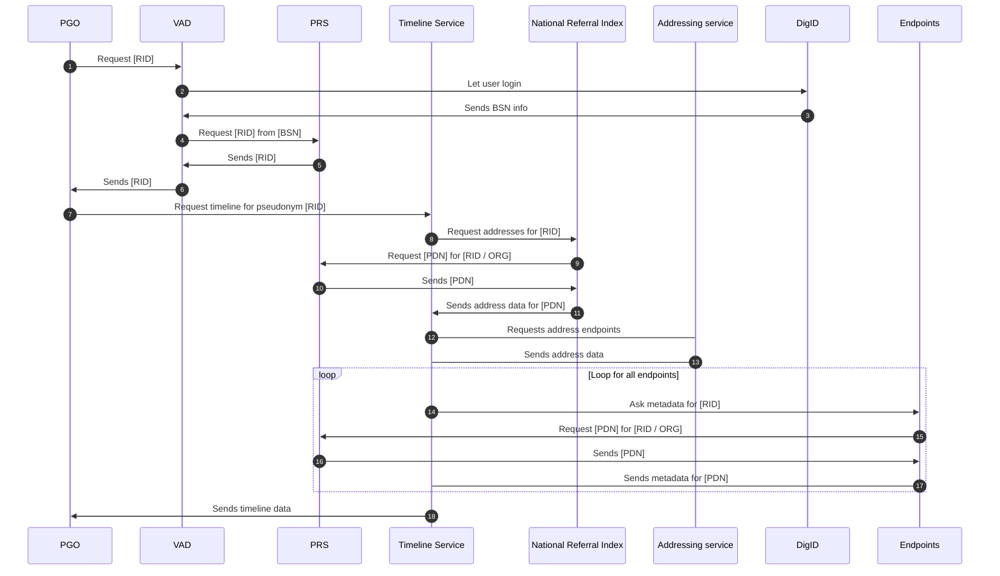

# PRS flow

- Step 1: The PGO requests a RID for the given user. Since we do not know the BSN, we ask the VAD which in turn will ask the user to login with DigID.
- Step 2: The VAD will enter the DigID flow and let the user login with for instance the DigID app.
- Step 3: The DigID app will send the BSN info to the VAD.
- Step 4-6: The VAD will request a RID and sends this back to the PGO. This RID is valid for the logged in BSN.
- Step 7: The PGO requests the timeline for the given RID.
- Step 8: The timeline service will first ask the NRI for the addresses known with information for given RID.
- Step 9-10: To do this, it first need to convert the RID into a PDN for the NRI. It will ask the PRS to exchange.
- Step 11: Once the NRI has the correct PDN, it can query address information and return it the to the timeline service.
- Step 12-13: The timeline service will request all the endpoints for the found addresses.
- Step 14: The timeline service will connect to the given metadata endpoint with a RID.
- Step 15-16: The metadata endpoint will request a PDN for the given RID.
- Step 17: Now that the endpoint has the correct PDN, it can request the metadata for that user and return that metadata.
- Step 18: After aggregating the metadata from all endpoints, it will be sent back to the PGO.  
