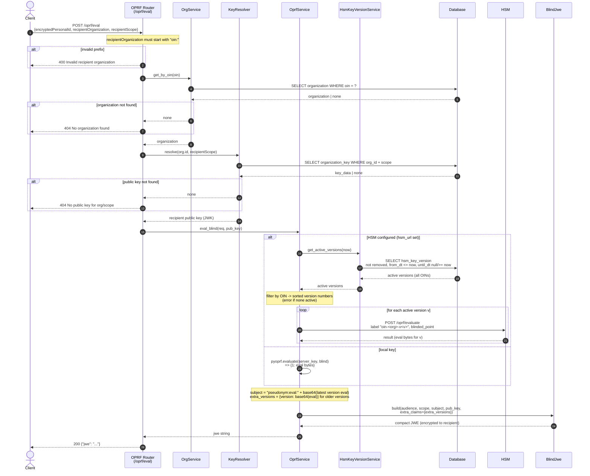

# OPRF evaluation flow (`POST /oprf/eval`)

This describes the internal PRS flow when a client asks the PRS to evaluate a
blinded personal identifier. The evaluation can run either against a local OPRF
key or, in production, against an HSM. When the HSM is used, the active key
versions are looked up from the `hsm_key_version` table (per OIN, for the current
date), the blind is evaluated against **every** active version, and the resulting
JWE stays backwards compatible: the `subject` always carries the latest version,
while older versions are added in a separate `extra_versions` claim.

Expired key versions are removed from the HSM by a separate scheduled program;
see [Expired HSM key cleanup](./hsm-key-cleanup.md).

