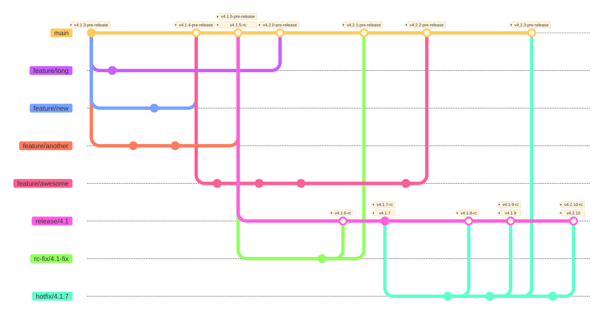

# Release Process

> - **Development:** `x.y.z-pre-release`  
> - **Release Candidate:** `x.y.z-rc`  
> - **Final Release:** `x.y.z`  
> - **After RC creation:** Increment the minor version for further development (`x.(y+1).0-pre-release`)

---

## Introduction

This release flow provides a clear, predictable, and stable progression from development builds to final releases.

Releases always fall into one of three categories:
- **Development** – ongoing work, unstable features.  
- **Release Candidate** – validation phase, used for QA, privacy, and security audits.  
- **Final Release** – production-ready version, approved after the checklist is complete.  

By following this naming scheme, the release phase is always explicit.  
A release candidate represents the version being validated, while a final release confirms that it has successfully passed all checks.

In the diagram below an example is drawn out where features are merged to the main branch.
At a certain point the decision is made to create a final release. At that moment `v4.1.5-rc` tag is created.
If additional work is required by QA, privacy or security on the RC a release branch is created.
Work done on the release branch needs also be merged back to the main branch when this is related to functionality
that is still in the main branch. In this example v4.2.10 does include fixes that does not needs to be merged back.

---

### Release reliability

> [!IMPORTANT]  
> Use only **Final releases** on production environments. 

Do not make any assumptions on non **Final releases**. During the development phase pre-releases are created to test and
validate the software. Only when the software is **Final** you can assume that the checks are performed and approved
by QA, Privacy and Security.

## Development Phase

During development, versions use the `-pre-release` suffix.  
This marks them as unstable and not yet ready for production.  

Example version flow:
  - `3.0.4-pre-release`  
  - `3.0.5-pre-release`  
  - `3.1.0-pre-release`

---

## Release Candidate Phase

When a release is prepared, the first release candidate (RC) is created from the current development version.  
RCs use the `-rc` suffix and represent versions that are feature-complete but still under validation.  

When additional work needs to be done on a release candidate,
a dedicated branch is created for the release, for example: `release/3.1`  

Example progression:
  - `3.1.0-rc`
  - `3.1.1-rc`
  - `3.1.2-rc`  

During this release the following checklists are executed. 

- [QA](qa-release-checklist.md)
- [Privacy](privacy-release-checklist.md)
- [Security](security-release-checklist.md)

---

## Final Release

Once the release candidate has successfully passed the full checklist, it is promoted to a final release.  
The `-rc` suffix is removed, resulting in the stable version.  
For example: `3.1.2`. 

---

## Post-Release Development

After the first release candidate is created, the minor version is always incremented for ongoing development.  
This ensures that feature development continues separately from release stabilization.  
For example, after creating `3.1.0-rc`, development continues with `3.2.0-pre-release`.
